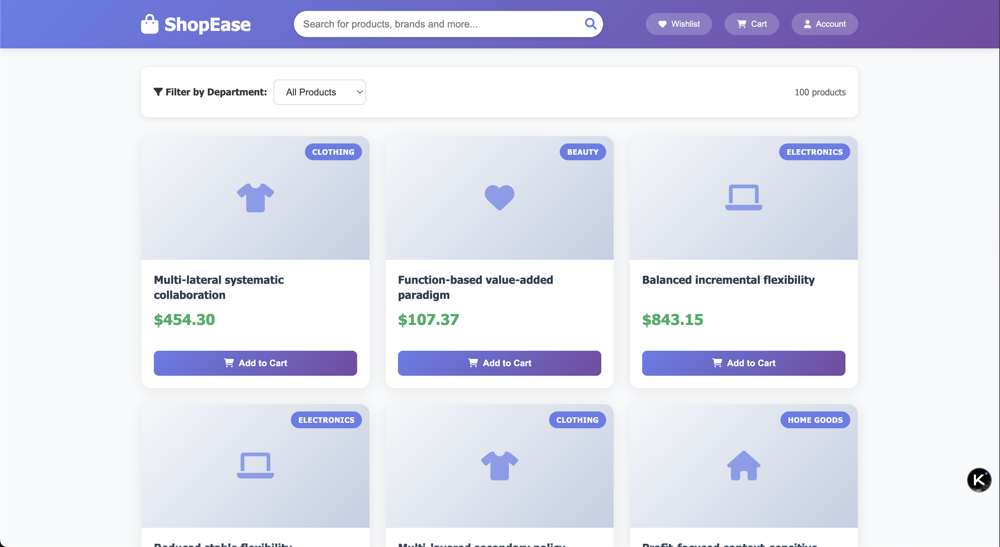

# E-Commerce Project - Frontend/Backend




A modern e-commerce web application built with a clean frontend/backend separation. The backend provides a REST API built with Flask, while the frontend is a standalone client application using vanilla HTML, CSS, and JavaScript.

## 🚀 Features

- ✅ **Product Catalog**: Browse 100+ sample products across 8 departments
- ✅ **Search & Filter**: Real-time search with department filtering
- ✅ **Pagination**: Clean pagination (12 products per page)
- ✅ **Product Details**: Detailed product pages with metadata
- ✅ **Responsive Design**: Mobile-friendly UI with modern styling
- ✅ **API-First**: RESTful API backend that can serve multiple frontends
- ✅ **CORS Support**: Cross-origin requests enabled for frontend/backend separation

## 📁 Project Structure

```
e-com/
├── README.md               # This file
├── backend/                # Flask API Server
│   ├── app.py             # Main Flask application
│   ├── requirements.txt   # Python dependencies
│   ├── database.db        # SQLite database (generated)
│   ├── init_db.py         # Database initialization script
│   ├── products.csv       # Sample product data
│   └── seed.py            # Data generation script
└── frontend/              # Client-side Application
    ├── index.html         # Main product listing page
    ├── product.html       # Product detail page
    ├── css/               # Stylesheets
    │   ├── main.css       # Main page styles
    │   └── product.css    # Product detail styles
    ├── js/                # JavaScript files
    │   ├── main.js        # Main page functionality
    │   └── product.js     # Product detail functionality
    └── images/            # Frontend images (future use)
```

## ⚙️ Prerequisites

- **Python 3.7+** (for backend)
- **Web browser** (for frontend)
- **Terminal/Command prompt**

## 🛠️ Installation & Setup

### Step 1: Clone/Download the Project
```bash
# If using git
git clone <repository-url>
cd e-com

# Or download and extract the ZIP file
```

### Step 2: Backend Setup

1. **Navigate to backend directory:**
   ```bash
   cd backend
   ```

2. **Install Python dependencies:**
   ```bash
   # Option 1: Using pip directly
   pip install -r requirements.txt
   
   # Option 2: Using virtual environment (recommended)
   python -m venv venv
   source venv/bin/activate  # On Windows: venv\Scripts\activate
   pip install -r requirements.txt
   ```

3. **Initialize the database:**
   ```bash
   python init_db.py
   ```
   
   You should see output like:
   ```
   Successfully created normalized database:
   - 8 departments
   - 100 products
   ```

### Step 3: Frontend Setup
No installation required! The frontend uses vanilla HTML/CSS/JavaScript.

## 🚀 Running the Application

### Start the Backend API Server

1. **Navigate to backend directory:**
   ```bash
   cd backend
   ```

2. **Activate virtual environment (if using one):**
   ```bash
   source venv/bin/activate  # On Windows: venv\Scripts\activate
   ```

3. **Start the Flask server:**
   ```bash
   python app.py
   ```
   
   You should see:
   ```
   * Running on http://127.0.0.1:5000
   * Debug mode: on
   ```

### Start the Frontend Server

**Open a new terminal window/tab** and choose one of these options:

**Option 1: Python HTTP Server**
```bash
cd frontend
python -m http.server 8000
```

**Option 2: Live Server (VS Code)**
1. Install "Live Server" extension in VS Code
2. Right-click on `frontend/index.html`
3. Select "Open with Live Server"

**Option 3: Any Static Server**
Use any static file server like `http-server` (Node.js), or simply open `index.html` in your browser (though API calls might not work due to CORS).

### Access the Application

- **Frontend**: http://localhost:8000
- **Backend API**: http://127.0.0.1:5000
- **API Documentation**: See API endpoints below

## 🔌 API Endpoints

| Method | Endpoint | Description | Parameters |
|--------|----------|-------------|------------|
| `GET` | `/api/departments` | Get all departments | None |
| `GET` | `/api/products` | Get products with pagination | `page`, `per_page`, `department_id`, `search` |
| `GET` | `/api/products/{id}` | Get specific product details | `id` (path parameter) |

### Example API Calls

```bash
# Get all departments
curl http://127.0.0.1:5000/api/departments

# Get first page of products
curl http://127.0.0.1:5000/api/products

# Search for "laptop" in Electronics department
curl "http://127.0.0.1:5000/api/products?search=laptop&department_id=1"

# Get product with ID 5
curl http://127.0.0.1:5000/api/products/5
```

## 🧪 Development

### Regenerate Sample Data

To create new sample products:
```bash
cd backend
python seed.py  # Generates new products.csv
python init_db.py  # Rebuilds database with new data
```

### Backend Dependencies

- **Flask**: Web framework for API
- **Flask-CORS**: Cross-origin resource sharing support
- **Faker**: Generate realistic sample data

### Frontend Technologies

- **HTML5**: Semantic markup
- **CSS3**: Modern styling with Grid/Flexbox
- **JavaScript ES6+**: Fetch API, async/await
- **Font Awesome**: Icons

## 🔧 Troubleshooting

### Backend Issues

**Import Error: No module named 'flask'**
```bash
pip install -r requirements.txt
```

**Database Error: no such table**
```bash
python init_db.py
```

**CORS Error: Cross-origin request blocked**
- Ensure Flask-CORS is installed: `pip install flask-cors`
- Check that backend is running on correct port

### Frontend Issues

**Products not loading**
- Ensure backend is running on http://127.0.0.1:5000
- Check browser console for error messages
- Verify API endpoints are accessible

**Search not working**
- Check network tab in browser dev tools
- Ensure API calls are reaching the backend

## 📝 Next Steps

### Potential Enhancements

1. **User Authentication** - Login/register system
2. **Shopping Cart** - Add to cart functionality with persistence
3. **Order Management** - Checkout and order tracking
4. **Product Images** - Real product photos
5. **Admin Panel** - Product management interface
6. **Payment Integration** - Stripe, PayPal, etc.
7. **Database Upgrade** - PostgreSQL for production
8. **Frontend Framework** - React, Vue, or Angular version
9. **Deployment** - Docker containers, cloud hosting

### Architecture Benefits

- **Scalable**: Frontend and backend can scale independently
- **Flexible**: Easy to swap frontend frameworks or add mobile apps
- **API-First**: Backend can serve multiple clients
- **Modern**: Uses current web development best practices
